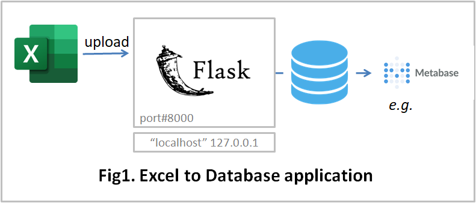

# Excel to Database application

# 1. What you can do

* To accumulate excel forms to the database. 
* To learn the flask application, which uses blueprint.

 

 

# 2. How to use

* Install the prerequisite python libraries

* Environment setting
  * Edit settings.py
    * PYTHON_EXE_FILE

 

* Program start
  * cd e2dapp-flask
  * python.exe app.py

 

* Open browser
  * http://localhost:8000/login
  * Login Email address/Password: sakura.suwa@example.com/helloe2d

 

# 3. System
* OS: Windows 10, Ubuntu 20.04.6 LTS, Azure Web App(Linux)
* Web Framework: Flask
* Python 3.12.7
* Python Libraries: See requirements.txt
* Bootstrap 5.2.3
* jQuery 3.7.1
* Database: SQLite3

 

# 4. Undisclosed Functions
* Authentication(Sign up, Change password)
* Database(PostgreSQL, MongoDB)
* Machine Learning

 

# 5. Initialization
(1) To sign-up a database administrator [UNDISCLOSED] 
(2) The database administrator submits the following control files: [UNDISCLOSED] 
   * database_info_entry.xlsx 
   * group_info_entry.xlsx(group administrators information) 

(3) To sigh-up a group administrator [UNDISCLOSED] 
(4) The group administrator submits the following control files: 
  * form_info_entry.xlsx(sumittable forms information） 
  * group_info_entry.xlsx(user information)

 

# 6. Directories and Files Overview

| Directory/File |D/F| description |
| :------------- | :-| :---------- |
| appmain | Dir | main programs |
| appml | Dir | machine learning [UNDISCLOSED] |
| auth | Dir | authentication |
| database | Dir ||
| download | Dir | sample data files |
| instance | Dir | system definition files |
| log | Dir ||
| manual | Dir ||
| models | Dir | database table definitions |
| templates | Dir ||
| topview | Dir ||
| app.py  | File | start program |
| READMD.md | File ||
| requirements.txt | File | prerequisite libraries |
| setting.py | File ||
